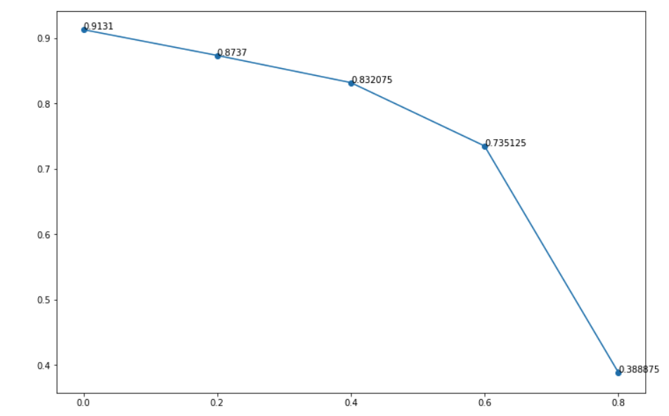

# Report of CVML Test: Noisy Label

## Shuai Liu

**Code repository**: https://github.com/1170500804/NoisyLabelTest.git

**The instruction of the test case is: [click here](https://github.com/1170500804/NoisyLabelTest/blob/master/materials/CVML_testcase_NoisyLabel.pdf)**

**This test case references a paper: [Ghosh et.al. AAAI 2017](https://aaai.org/ocs/index.php/AAAI/AAAI17/paper/view/14759/0)**

**Since the GitHub markdown interpreter doesn't fully support LaTex, a [comment on results](https://github.com/1170500804/NoisyLabelTest/blob/master/materials/comments_on_results.pdf) is uploaded in the format of pdf.**

## 1. Introduction

The language and framework that I use to implement this model is Python3 and Pytorch. The whole project is composited with 6 python files: `backbone.py, data.py, evaluate.py, loss.py, main.py, settle_datset.py`. The following of this section is the description of these files and their functions.

**main.py**

Run this file to train the model. To run the improved model, 

```shell
python3 main.py -a 0.1 -b 1 --eta 0.6 --lr 0.1 --batch-size 512 --aug
```

To run the baseline:

```shell
python3 main.py --baseline --eta 0.6 --lr 0.1 --batch-size 512 --aug
```

To evaluate the trained model:

```shell
python3 main.py --eval --resume [path to saved model]
```

**Backbone.py**

This file implements the backbone, which is an 8-layer neural network, specified in the problem description. Kaiming normal Initialization is used in the implementation.

**Data.py**

This file implements the interface that loads data during training phase. The data augmentation I use is *Random Crop* and *Random Horizontal Flip.*

**evaluate.py**

This file implements the evaluate method.

**loss.py**

This file implements the reversed cross entropy with log0=-4

**settle_dataset.py**

This file transfers format of the cifar-10: pickle object to jpg files.

## 2. Result

### 2.1 noise rate=0.6, alpha=0.1, beta=1

|       CES        |    Baseline    |
| :--------------: | :------------: |
| 73.5125$\pm$0.34 | 36.3$\pm$12.32 |

### 2.2 vary noise rate, alpha=0.1, beta=1



### 2.3 Observations

+ Comparing the baseline to CES, it is obvious that the latter one is far more robust to perturbations in the case of noise rate being 0.6. 
+ The varying noise rate result shows that CES could perform well when the noise rate is less than or equal to 0.4. 
+ There are performance gaps when the noise rate goes from 0.4 to 0.6 and 0.6 to 0.8. In these two cases, the dataset is noisy to a large extent and it is expectable that the model couldn't perform well.